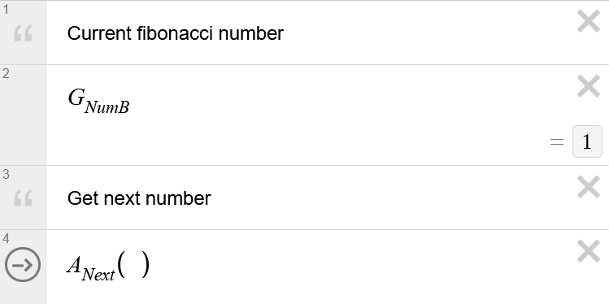

# **Desmosify**

Create graphs in plain text

```
public {
    "Current fibonacci number:";
    num_b;
    "Get next number:";
    action next();
}

var num_a: int = 0;
var num_b: int = 1;

action next() {
    num_a := num_b,
    num_b := num_a + num_b,
}
```



Desmosify is a programming language which is based around the structure of a
[Desmos]({{site.desmos_url}}/) graph, and which can be compiled into such a graph.
